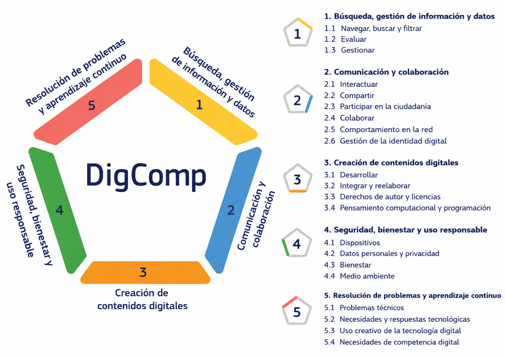

# DigiComp 3.0: Marco Europeo de Competencias Digitales

## ¿Qué es DigiComp 3.0?

DigiComp 3.0 es el marco europeo de competencias digitales desarrollado por la Comisión Europea para definir qué habilidades necesita una persona para desenvolverse de manera eficaz, crítica, segura y responsable en entornos digitales.

El marco no se centra únicamente en el uso técnico de herramientas digitales, sino también en el pensamiento crítico, la comunicación, la seguridad, la creación de contenidos y la capacidad de adaptación a un entorno tecnológico en constante evolución.

La nueva versión incorpora de forma transversal aspectos relacionados con:

- Inteligencia Artificial
- Bienestar digital
- Derechos digitales
- Sostenibilidad tecnológica
- Ciudadanía digital responsable

DigiComp 3.0 organiza las competencias digitales en **cinco grandes áreas**.

---

# 1. Alfabetización en información y datos

## Descripción

Esta competencia consiste en saber buscar, localizar, filtrar, analizar y evaluar información digital.

No se trata únicamente de encontrar información, sino de ser capaz de:

- distinguir fuentes fiables,
- detectar información falsa o sesgada,
- organizar datos,
- interpretar correctamente la información encontrada.

En la versión 3.0 adquiere especial relevancia la evaluación crítica de información generada mediante Inteligencia Artificial.

## Ejemplo

Un estudiante encuentra en redes sociales una publicación que afirma que una determinada dieta cura la diabetes.

En lugar de aceptar automáticamente esa afirmación:

- busca información en organismos sanitarios oficiales,
- compara distintas fuentes,
- revisa publicaciones científicas,
- verifica si existen evidencias reales.

Finalmente concluye que la afirmación carece de respaldo científico.

---

# 2. Comunicación y colaboración digital

## Descripción

Esta competencia se centra en interactuar y colaborar de forma eficaz en entornos digitales.

Incluye:

- comunicarse correctamente en plataformas digitales,
- trabajar en equipo online,
- compartir información,
- respetar normas de convivencia digital,
- adaptar el lenguaje al contexto y al canal utilizado.

No basta con “usar un chat” o una videollamada: implica saber colaborar de manera efectiva, ética y consciente.

La Inteligencia Artificial aparece aquí en herramientas como:

- asistentes virtuales,
- traducción automática,
- chatbots,
- sistemas automáticos de recomendación o comunicación.

## Ejemplo

Un grupo de estudiantes desarrolla un proyecto colaborativo utilizando herramientas online.

Para trabajar correctamente deben:

- coordinar tareas,
- comunicarse claramente,
- compartir documentos,
- resolver conflictos,
- mantener una comunicación respetuosa y eficaz.

---

# 3. Creación de contenidos digitales

## Descripción

Esta competencia implica crear, modificar y compartir contenidos digitales.

Puede incluir:

- textos,
- imágenes,
- vídeos,
- presentaciones,
- programación,
- contenido multimedia.

También incluye aspectos éticos y legales como:

- derechos de autor,
- licencias,
- citación de fuentes,
- uso responsable de herramientas de IA generativa.

La Inteligencia Artificial adquiere gran protagonismo en esta competencia mediante herramientas capaces de:

- generar texto,
- crear imágenes,
- producir código,
- editar contenido automáticamente.

## Ejemplo

Un estudiante elabora una infografía científica utilizando herramientas digitales.

Para hacerlo correctamente debe:

- seleccionar información fiable,
- diseñar contenido visual claro,
- citar las fuentes,
- respetar licencias,
- adaptar el contenido al público objetivo.

---

# 4. Seguridad digital

## Descripción

Esta competencia consiste en proteger:

- dispositivos,
- datos personales,
- privacidad,
- identidad digital,
- bienestar digital.

Incluye:

- uso de contraseñas seguras,
- detección de fraudes,
- configuración de privacidad,
- prevención de riesgos digitales,
- identificación de deepfakes y amenazas basadas en IA.

También aborda el impacto del uso digital sobre:

- la salud,
- el bienestar emocional,
- el medio ambiente.

## Ejemplo

Una persona recibe un correo electrónico sospechoso solicitando datos bancarios.

Gracias a sus competencias digitales:

- identifica señales de fraude,
- evita hacer clic en enlaces peligrosos,
- verifica la autenticidad del remitente,
- protege su información personal.

---

# 5. Resolución de problemas

## Descripción

Esta competencia implica identificar y resolver problemas en entornos digitales.

Incluye:

- adaptarse a nuevas herramientas,
- aprender tecnologías emergentes,
- solucionar incidencias técnicas,
- evaluar alternativas,
- aprender continuamente.

La Inteligencia Artificial aparece aquí como herramienta de apoyo para:

- buscar soluciones,
- automatizar tareas,
- sugerir alternativas,
- analizar problemas.

Sin embargo, DigiComp insiste en mantener siempre el juicio crítico humano.

## Ejemplo

Una aplicación deja de funcionar correctamente durante una actividad académica.

En lugar de bloquearse, el estudiante:

- busca posibles soluciones,
- consulta documentación,
- prueba alternativas,
- aprende nuevas herramientas,
- adapta su trabajo al nuevo contexto.

---

# Conclusión

DigiComp 3.0 no se centra únicamente en “usar tecnología”.

El objetivo es desarrollar ciudadanos digitales capaces de:

- pensar críticamente,
- colaborar,
- crear,
- protegerse,
- adaptarse continuamente,
- y convivir responsablemente con tecnologías emergentes como la Inteligencia Artificial.

La competencia digital ya no es opcional: se ha convertido en una habilidad fundamental para la vida académica, profesional y social.

# Enlaces de interés

- [The European Commission updates its digital competence framework DigComp](https://joint-research-centre.ec.europa.eu/jrc-news-and-updates/european-commission-updates-its-digital-competence-framework-digcomp-2025-11-27_en)